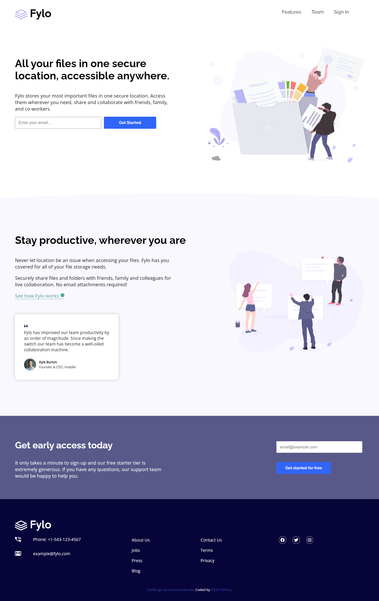
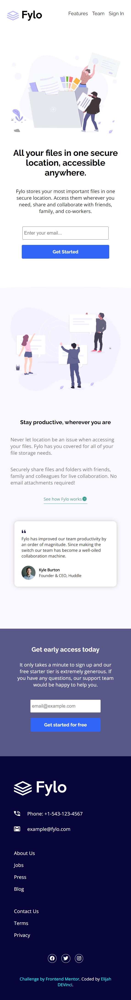

# Frontend Mentor - Fylo landing page with two column layout solution

This is a solution to the [Fylo landing page with two column layout challenge on Frontend Mentor](https://www.frontendmentor.io/challenges/fylo-landing-page-with-two-column-layout-5ca5ef041e82137ec91a50f5). Frontend Mentor challenges help you improve your coding skills by building realistic projects. 

## Table of contents

- [Overview](#overview)
  - [The challenge](#the-challenge)
  - [Screenshot](#screenshot)
  - [Links](#links)
- [My process](#my-process)
  - [Built with](#built-with)
- [Author](#author)
- [Acknowledgments](#acknowledgments)

## Overview

### The challenge

Users should be able to:

- View the optimal layout for the site depending on their device's screen size (Desktop: 1440px & Mobile: 375px)
- See hover states for all interactive elements on the page

### Screenshot (Desktop View) 👇

### Screenshot (Mobile View) 👇

### Links

- Solution URL: [Add solution URL here](https://www.frontendmentor.io/solutions/fylo-landing-page-with-two-column-layout-HM_DmcSazh)
- Live Site URL: [Fylo Landing Page](https://elijah-fylo-landing-page.netlify.app/)

## My process

### Built with

- Semantic HTML5 markup
- CSS custom properties
- Flexbox

## Author

- Frontend Mentor - [@ElijahTobs](https://www.frontendmentor.io/profile/yourusername)
- Twitter - [@elijahDEVinci](https://www.twitter.com/elijahDEVinci)

## Acknowledgments

Hats off to [Frontend Mentor](https://www.frontendmentor.io) for this awesome project.

